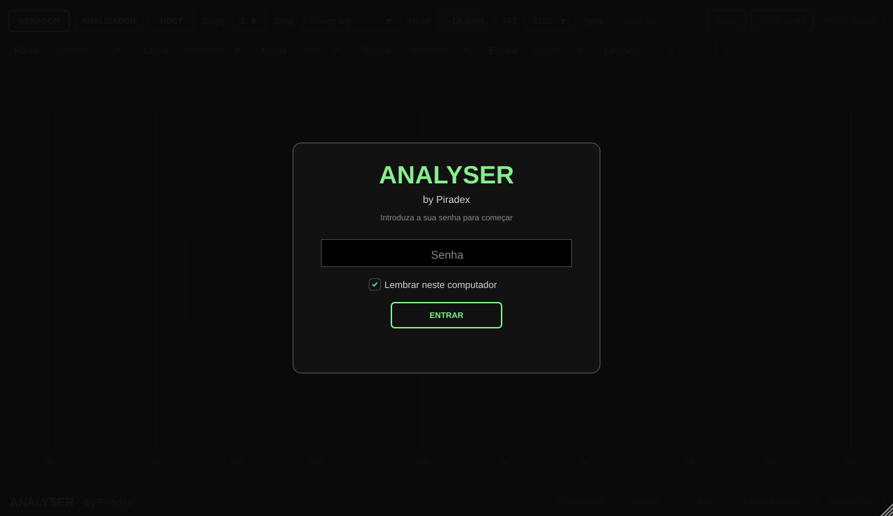
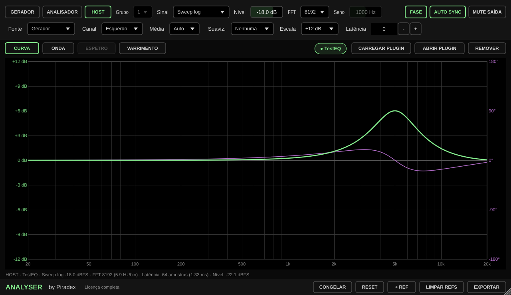
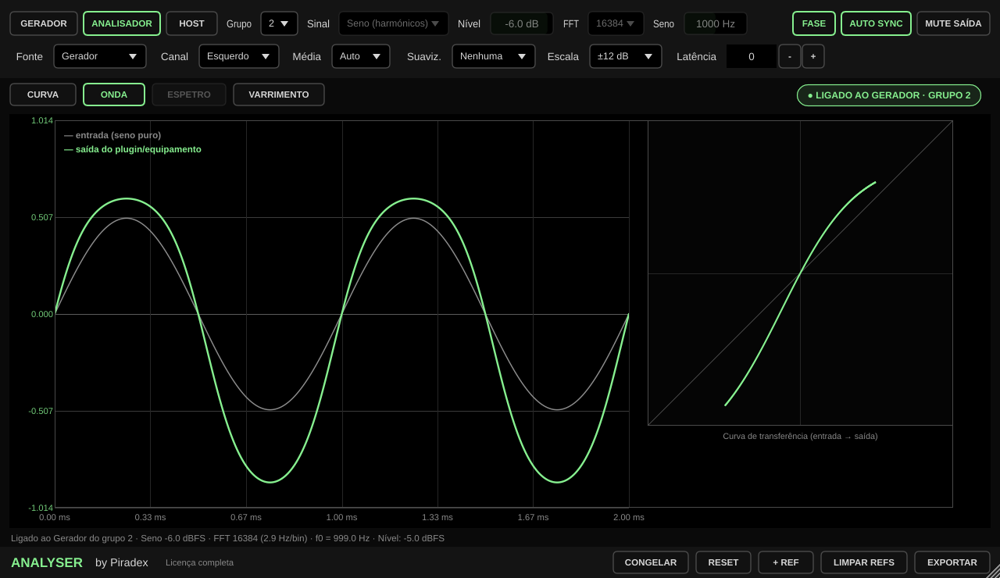
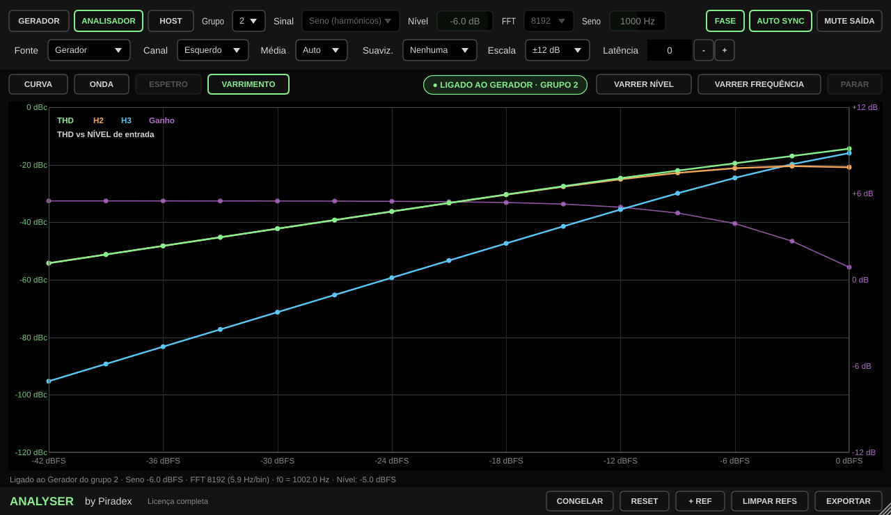
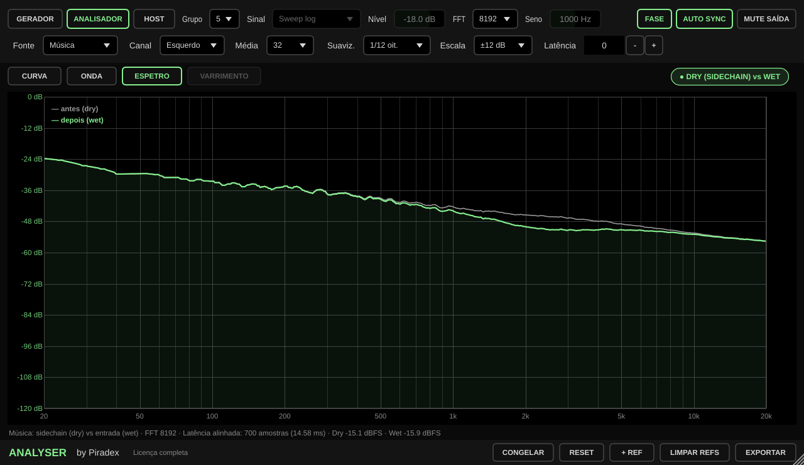
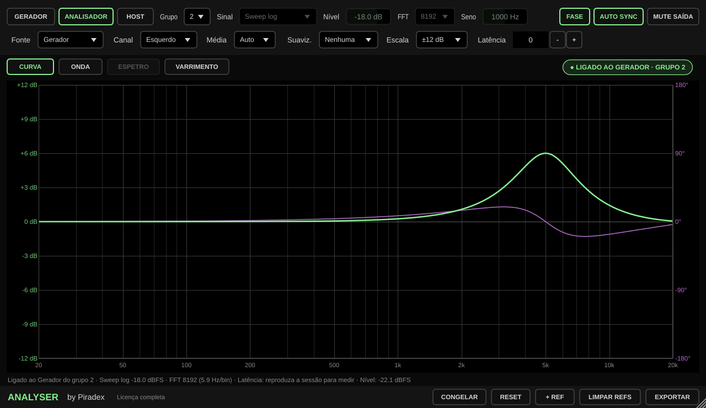
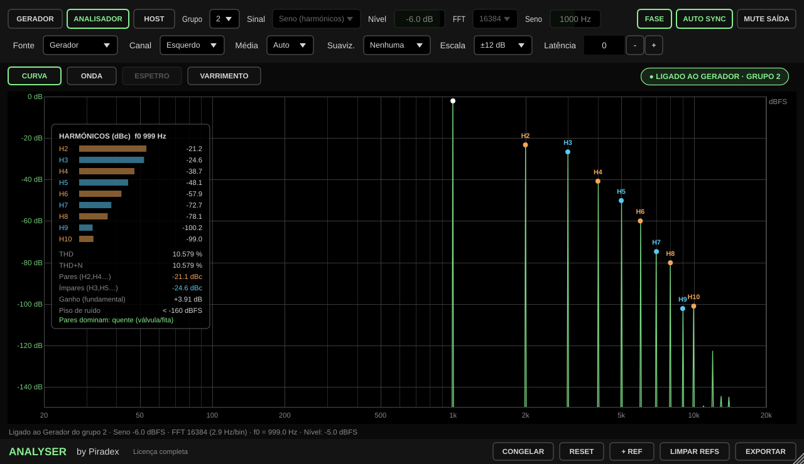
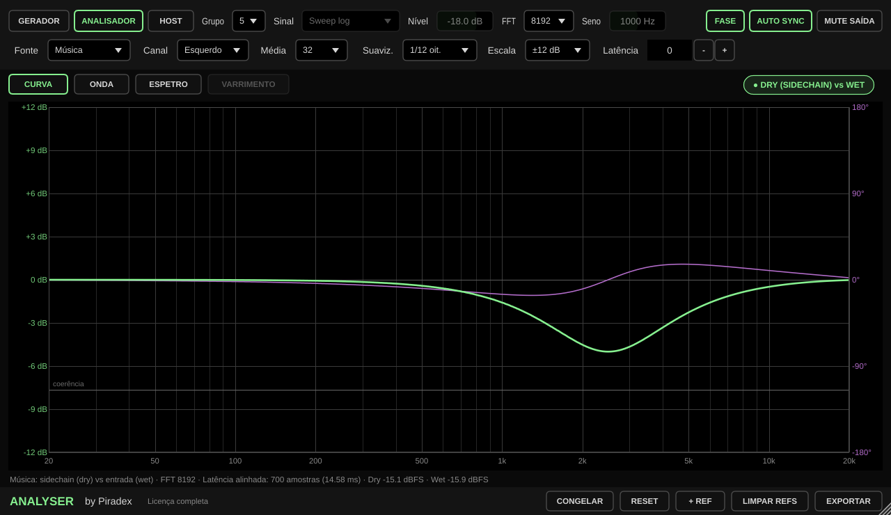

# ANALYSER by Piradex

Analisador de curvas para ver **exatamente o que um plugin ou um equipamento analógico faz ao som**: resposta em frequência, fase, latência, harmónicos/THD — e também o que o equipamento faz **com música real** (dry vs wet).

Formatos: **VST3** e **AU** para macOS **10.13 ou superior**, binário universal (**Intel** e **Apple Silicon**) — testado para correr em Macs de 2013 com Catalina; e **VST3 para Windows 10/11 (64 bits)**, com instalador. Código JUCE 8, C++17.

## Acesso por senha
Ao abrir o plugin aparece o ecrã de login. Há dois tipos de senha:
- **Master** — acesso completo, sem validade.
- **BETA** — para os beta testers, com data de validade (aparece no rodapé, a laranja).

"Lembrar neste computador" guarda a sessão (ligada a esse Mac). Enquanto não houver sessão, o plugin é **transparente**: deixa passar o áudio sem mexer em nada, para não estragar sessões.

O código não contém as senhas — só um *salt* e o hash PBKDF2-HMAC-SHA256 (60 000 iterações) de cada uma. Para criar novas senhas beta:
```
python3 tools/nova_senha_beta.py 2027-03-31
```
Cola a linha impressa em `kKeys` (`Source/License.cpp`) e faz push — o GitHub compila. Nunca escrevas as senhas em ficheiros do repositório.

## Instalação no Windows
O GitHub Actions gera `ANALYSER-by-Piradex-1.1.0-Windows-Setup.exe` (instala o VST3 em `C:\Program Files\Common Files\VST3`) e um `.zip` para instalação manual. Não precisa do *Visual C++ Redistributable*. Como o instalador não tem assinatura digital, o Windows pode mostrar "O Windows protegeu o seu PC": **Mais informações → Executar mesmo assim**.

## Instalação no Mac
O GitHub Actions gera `ANALYSER-by-Piradex-1.1.0-macOS.dmg` com o instalador `.pkg` (VST3 + AU) e um `LEIA-ME.txt`. Como o instalador não está assinado com um certificado da Apple, na primeira vez: **botão direito no .pkg → Abrir → Abrir**.

---

## Novidades na 1.1

- **Modo HOST (uma só instância):** clica em **HOST**, depois em **CARREGAR PLUGIN** e escolhe o EQ, compressor ou saturador (VST3 ou AU). **ABRIR PLUGIN** abre a janela dele; mexe nos botões e a curva muda ao vivo. Com **Fonte = Música**, a faixa passa pelo plugin carregado (ouves o plugin) e o ANALYSER compara antes/depois sem precisar de sidechain. O plugin carregado e as definições dele ficam guardados na sessão.
- **Curva em tempo real:** blocos sobrepostos (4× mais atualizações) e **Média = Auto**. Num plugin digital não há ruído, por isso a curva mostra logo cada mudança (~¼ s). Em hardware com ruído a média sobe sozinha e recomeça quando mexes num botão.
- **Separadores de vista:**
  - **CURVA** — magnitude e fase (ou harmónicos com o seno).
  - **ONDA** — com o seno: um ciclo da entrada e da saída sobrepostos + **curva de transferência** (vês a onda achatar, ficar assimétrica ou cortar). Com o sweep: a **resposta impulsional** (pré-ringing de EQs de fase linear, etc.). Com música: dry e wet alinhados.
  - **ESPETRO** — música: espetro antes (cinzento) e depois (verde).
  - **VARRIMENTO** — **VARRER NÍVEL** (seno de -42 a 0 dBFS: THD, H2, H3 e ganho → onde o equipamento começa a saturar e a comprimir) e **VARRER FREQUÊNCIA** (THD de 31 Hz a 10 kHz).
- **Botões GERADOR / ANALISADOR / HOST** grandes e indicador de ligação (verde = ligado ao Gerador do grupo).
- **Latência exata** quando o DAW está a tocar (usa a timeline partilhada) e sempre no modo HOST.

> Logic Pro corre os AU num processo próprio; carregar outros AU dentro do ANALYSER pode não funcionar aí — nesse caso usa a versão VST3 do plugin a medir, ou o modo Gerador + Analisador.

## Os 3 modos

### 1. Resposta (curva + fase) — plugins e hardware
Duas instâncias do mesmo plugin, no mesmo **Grupo**:

```
[ANALYSER: GERADOR]  →  [plugin a medir / insert de hardware]  →  [ANALYSER: ANALISADOR]
```

1. Na primeira instância escolha **Papel = Gerador** e o **Sinal**: `Sweep log` (recomendado), `Impulso` ou `Ruído rosa`.
2. Na última instância deixe **Papel = Analisador** e o **mesmo Grupo**.
3. Reproduza ou ponha a faixa em monitorização. A curva verde é a magnitude, a roxa é a fase.

O Analisador adota automaticamente o Sinal, Nível e FFT do Gerador do mesmo grupo (a barra de estado diz *"Ligado ao Gerador do grupo N"*). Se o seu DAW isolar plugins em processos separados, o Analisador mostra *"a usar definições próprias"* — basta pôr Sinal/Nível/FFT iguais nos dois.

**Auto Sync** deteta a latência (do plugin, do conversor AD/DA, do roundtrip do hardware) e retira-a da fase, para ver só a fase "real" do processamento. A latência aparece na barra de estado em amostras e ms. **Latência** (± amostras) soma um ajuste manual; com Auto Sync desligado, a última latência detetada fica fixa.

### 2. Harmónicos / THD — saturação, válvulas, fita, transformadores
No Gerador escolha **Sinal = Seno (harmónicos)** e a frequência (**Seno**). O seno é colocado exatamente no centro de um bin da FFT, por isso os harmónicos são lidos sem "leakage".

O painel mostra H2…H10 em **dBc** (relativo à fundamental), **THD**, **THD+N**, energia de harmónicos **pares vs ímpares**, ganho na fundamental e o piso de ruído. Leitura rápida do carácter:

- **Pares dominam** → coloração "quente", assimétrica (típico de válvula single-ended, fita, alguns transformadores)
- **Ímpares dominam** → simétrica (transístor, clipping, push-pull)

Dica: suba o **Nível** no Gerador em passos (−24, −18, −12, −6 dBFS) para ver como o equipamento entra em saturação.

### 3. Música (dry vs wet) — o que o equipamento faz no material real
Uma só instância, em **Papel = Analisador** e **Fonte = Sidechain (música)**:

- **Entrada principal** = sinal processado (wet, depois do plugin/hardware)
- **Sidechain** = sinal original (dry, antes do plugin/hardware)

A curva é estimada por média de Welch (H = Sxy/Sxx) e a latência entre dry e wet é alinhada automaticamente. A linha cinzenta em baixo é a **coerência** (0–1): perto de 1 o comportamento é linear (EQ); quando desce, há distorção, compressão a mexer ou ruído naquela zona. Use **Média** alta (16–32) e **Suavização** 1/12 ou 1/6 oit. para curvas estáveis.

---

## Medir equipamento analógico

```
[Gerador] → [insert de hardware: saída da placa → equipamento → entrada da placa] → [Analisador]
```

Use o insert de hardware do seu DAW (Ableton: *External Audio Effect*; Logic: plugin *I/O*; Reaper: *ReaInsert*; Studio One: *Pipeline*; Cubase: *External FX*). O Auto Sync trata do atraso do roundtrip, por isso não precisa de medir o ping.

Para o carácter do equipamento com música: mande a música para o hardware e meta o sinal **antes** do insert no sidechain do Analisador (envio pré-insert).

---

## Controlos

| Controlo | Função |
|---|---|
| Papel | Gerador (emite o sinal de teste, substitui o áudio) ou Analisador (mede, passa o áudio) |
| Grupo | 1–8. Liga Gerador e Analisador. Use grupos diferentes para medir várias cadeias ao mesmo tempo |
| Sinal | Impulso · Sweep log (melhor relação sinal/ruído nos graves) · Ruído rosa · Seno (harmónicos) |
| Nível | Nível de pico do sinal de teste (dBFS) |
| FFT | 4096–65536. Maior = mais resolução nos graves, atualização mais lenta |
| Seno | Frequência do seno de harmónicos (arredondada ao centro do bin) |
| Fonte | Gerador ou Sidechain (música) |
| Canal | Esquerdo, Direito, Mid ou Side — o que é analisado |
| Média | Nº de blocos em média (∞ = acumula sempre). Reset recomeça |
| Suaviz. | Suavização em fração de oitava |
| Escala | ±3 a ±48 dB |
| Fase / Auto Sync / Latência | Ver acima |
| Mute saída | Silencia a saída do Analisador (não ouve o sinal de teste) |
| Congelar | Para de acumular — compare com o plugin desligado, etc. |
| + Ref / Limpar refs | Guarda até 4 curvas de referência sobrepostas (cinzento, laranja, azul, amarelo) |
| Exportar | CSV em formato PT (`;` e vírgula decimal) — abre direto no Excel |

---

## Compilar

### GitHub Actions
Cada push corre os testes do DSP e depois, num Mac do GitHub: compila VST3 + AU universais (mínimo macOS 10.13), confirma as duas arquiteturas e a versão mínima, valida o AU com `auval` (nativo e Intel via Rosetta), corre o `pluginval` e cria o `.pkg` dentro de um `.dmg` (nos *Artifacts* da execução).

### Local
```
cmake -B build -DCMAKE_BUILD_TYPE=Release
cmake --build build --config Release
```
O JUCE 8.0.15 é descarregado automaticamente (ou use `-DJUCE_PATH=/caminho/para/JUCE`).

Testes: `cmake -B build -DANL_BUILD_TESTS=ON` e corra `pca_core_test` / `pca_plugin_test`.

> Códigos do plugin: fabricante `Prdx`, plugin `PxAN`. Se já usa outro código de fabricante nos seus plugins Piradex, troque em `CMakeLists.txt` (`PLUGIN_MANUFACTURER_CODE`).

---

## Validação

Os testes verificam, com instâncias reais do plugin:
- Login: senha errada recusada, master e beta aceites, validade da beta, plugin bloqueado = áudio intacto
- EQ conhecido (+6 dB @ 5 kHz) + 37 amostras de atraso → magnitude com erro < 0,15 dB, latência = 37 amostras
- Sweep, impulso e ruído rosa dão a mesma curva; fase correta mesmo com paragens do host a meio
- Saturação assimétrica → H2/H3 e THD iguais ao cálculo analítico (série de Fourier)
- Modo música: atraso desconhecido de 700/1234 amostras encontrado exatamente; curva com erro < 0,35 dB

## Notas
- Pro Tools (AAX) não está incluído: precisa do SDK AAX da Avid e assinatura PACE.
- A ligação automática por Grupo funciona quando as instâncias correm no mesmo processo (o normal na maioria dos DAWs).

## Capturas









